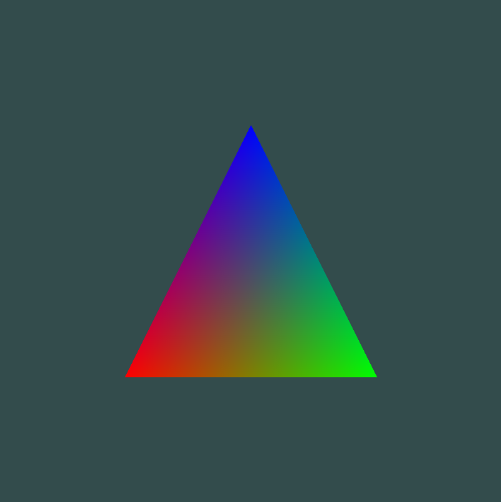
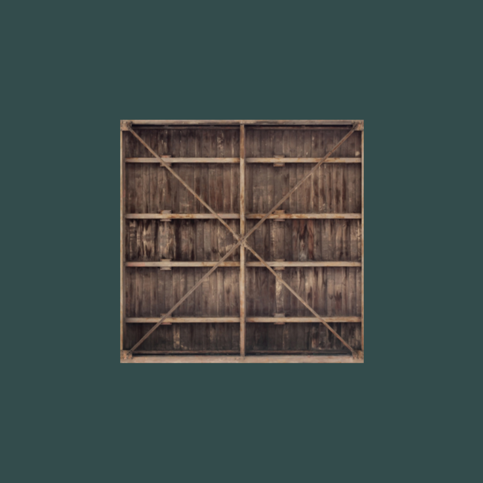

# Graphics Programming Reference
A collection of notes and scripts for various graphics programming techniques and paradigms. This is not intended to be a guide for graphics programming beginners, but it will cover theory and implementation of beginner to advanced techniques.

<p align="center">
    
    
    
    
</p>

## Contents

### OpenGL Reference
References on various topics regarding OpenGL theory and implementation. 
- [GLFW Window](./opengl_reference/window.md)
- [VBO](./opengl_reference/vbo.md)
- [EBO](./opengl_reference/ebo.md)
- [Shader](./opengl_reference/shader.md)
- [VAO](./opengl_reference/vao.md)
- [Texture](./opengl_reference/texture.md)

### Rendering Methods
High-level overviews of different methods/paradigms for therendering pipeline.
- [Individual Draw](./rendering_methods/individual_draw_rendering.md)
- [Batch](./rendering_methods/batch_rendering.md)
- [Instance](./rendering_methods/instance_rendering.md)

### Examples
Small scripts that show how to implement a specific technique.
Boilerplate example is standalone, but most rely on abstractions found in `examples/src`. 
- [OpenGL Boilerplate](./examples/01_boilerplate.cpp)
- [Abstracted Boilerplate](./examples/02_abstracted_boilerplate.cpp)
- [Triangle](./examples/03_triangle.cpp)
- [Quad](./examples/04_quad.cpp)
- [Color Attribute](./examples/05_color_attrib.cpp)
- [Texture](./examples/06_texture.cpp)
- [Transformation](./examples/07_transformation.cpp)

### Class Implementations
Collection of fully implemented classes to use for an abstracted OpenGL workflow. 
These are used in many of the examples. 
- [Window Class](./examples/src/window.cpp)
- [VBO Class](./examples/src/vbo.cpp)
- [EBO Class](./examples/src/ebo.cpp)
- [Shader Class](./examples/src/shader.cpp)
- [VAO Class](./examples/src/vao.cpp)
- [Image Class](./examples/src/image.cpp)
- [Texture Class](./examples/src/texture.cpp)

## Usage
This repo contains a number of examples. Use CMake to run these examples from source.

```bash
cd ./examples/build

cmake ..
```

This process will download all of the required dependencies to the build folder. This may take a few minutes. Once it has finished, you can build the executables. 

```bash
cmake --build .

```

This creates a seperate executable for every example. Simply run the desired example:

```bash
./example
```

## Sources
Here is a list of sources used to create this reference. I highly reccomend all of these for deeper understanding:
- [learnopengl](https://learnopengl.com)
- [OpenGL Wiki](https://www.khronos.org/opengl/wiki/)